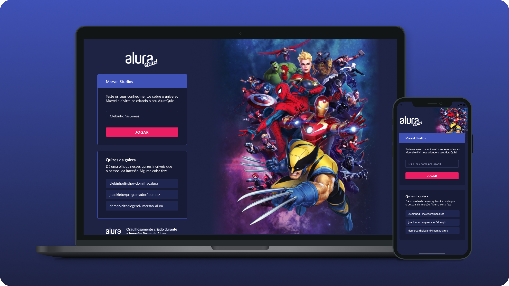
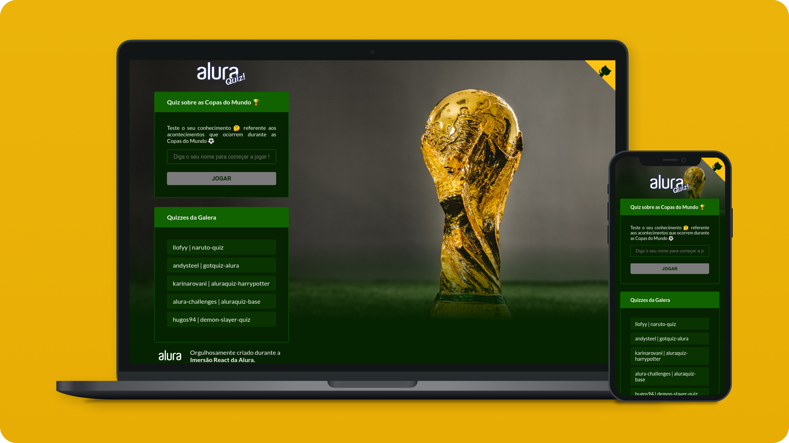

<h2><b>📃 Descrição:</b></h2>
<h4 align="justify">
Projeto desenvolvido durante a Imersão React da <a href="https://www.alura.com.br">Alura</a>, com o intuito de desenvolver uma aplicação do zero utilizando tecnologias como React, NextJS e Vercel. No qual foi proposto a criação de uma jogo de quizzes referente a um tema / assunto de escolha do desenvolvedor.
</h4>

 
<h2><b>🔖 Tema escolhido:</b></h2>
<h4 align="justify">
O tema escolhido para o meu projeto foi sobre as <i><u>Copas do Mundo</u></i>, onde o jogadores irá testar o seu conhecimento sobre alguns acontecimento que ocorrem durante as edições da competição já realizadas, como: recordes, lances marcantes, acontecimentos, historia ...
</h4>

 
<h2 align="left"><b>🛸 Tecnologias:</b></h2>
 

 

 

 

 

<!--  
 

 -->

 
<h2><b>🕹 Projeto proposto</b></h2>

<h5 align="center">
Clique na imagem para visualizar a prototipagem do projeto no figma
</h5>

 
<h2><b>⚽ Projeto realizado / desenvolvido</b></h2>

<h5 align="center">
Clique na imagem para visualizar o projeto
</h5>

 
 

Created with ❤ by **Antônio Narcilio** feat. [Alura](https://www.alura.com.br)
